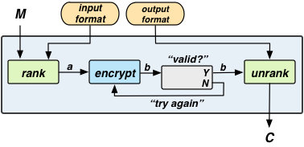

LibFTE
======

[](https://travis-ci.org/uProxy/libfte)

### Overview

LibFTE is an encryption library that allows input plaintext and output ciphertext formats to be defined by regular expressions.
Specifically, one can instantiate an FTE scheme FTE[R_in,R_out], where R_in specifies a regular language for the input plaintexts and R_out describes a regular language for the ouput ciphertexts.
Then, it's the job of the FTE scheme to encrypt plaintexts in the language L(R_in) into ciphertexts in the language of L(R_out).

Quickstart
----------

### Building

Ensure you have the following installed

* Standard build tools: make, m4, gcc, g++, etc.
* GMP: https://gmplib.org/

then

```shell
$ ./configure
$ make
```

Running ```make``` will produce ```.libs/libfte.a``` and ```bin/test```.

### Testing

```shell
$ make test
[==========] Running 64 tests from 9 test cases.
[----------] Global test environment set-up.
[----------] 2 tests from SanityCheckMatch
[ RUN      ] SanityCheckMatch.Test1
[       OK ] SanityCheckMatch.Test1 (0 ms)
...
[ RUN      ] ErrorTest.NoLanguageSet
[       OK ] ErrorTest.NoLanguageSet (0 ms)
[----------] 8 tests from ErrorTest (1 ms total)

[----------] Global test environment tear-down
[==========] 64 tests from 9 test cases ran. (1884 ms total)
[  PASSED  ] 64 tests.
```

FTE encryption example
----------------------

```c++
#include "fte/fte.h"
#include "regex2dfa.h"

void main() {
  std::string K = "FFFFFFFFFFFFFFFFFFFFFFFFFFFFFFFF"; // 128 bits, in hex
  fte::Fte fteObj = fte::Fte();
  fteObj.set_key(K);
  std::string plaintext_dfa;
  std::string ciphertext_dfa;
  regex2dfa::Regex2Dfa("^.+$", &plaintext_dfa);
  regex2dfa::Regex2Dfa("^(a|b)+$", &plaintext_dfa);
  fteObj.SetLanguages(plaintext_dfa, 16,
                      ciphertext_dfa, 128);
  std::string input_plaintext = "Hello, Word!";
  std::string ciphertext, output_plaintext;
  fteObj.Encrypt(input_plaintext, &ciphertext);
  fteObj.Decrypt(ciphertext, &output_plaintext);

  std::cout << "input_plaintext: " << input_plaintext << std::endl;
  std::cout << "ciphertext: " << ciphertext << std::endl;
  std::cout << "output_plaintext: " << output_plaintext << std::endl;
}
```

will output

```shell
input_plaintext: Hello, Word!
ciphertext: babbbaababababbbbabbbbaabbaabaaaaabbabaabaaabbaaaabbabaabaababaaabbbabbbaabababaaabbaabababbbbbbaabbbaaaaaaabbbbbabaabbbaaaabab
output_plaintext: Hello, Word!
```

LibFTE details
--------------

The LibFTE library is based on the rank-encipher-unrank construction presented in [FPE1] and revisited in [FTE2].
Let FTE[R_in, R_out] be an FTE scheme where R_in is a regular expression describing the set of possible plaintexts, and R_out is a regular expression describing the set of possible ciphertexts.
Let the function rank_R be a bijective mapping between the elements of language L(R) and the integers {0,1,...,|L(R)|-1}.
Let unrank_R be the inverse of rank_R.
Then, the construction is realized as follows:

1. On input of a plaintext M in L(R_in), calculate a = rank_{R_in} of M.
2. Using some encryption scheme, encrypt a to ciphertext b.
3. Interpret b as an integer, if b is in {0,1,...,|L(R_out)|-1}, then goto 4, else go back to step 2 and reencrypt b.
4. Calculate unrank_{R_out} of b as our output C.

We may visualize this as follows:



In our diagram the "valid?" check is the process of determining if b can be unranked into language L(R_out).
For DFA-based ranking this is an inequality.
However, in general, it turns out that the validation is not always so simple, hence we allow for arbitrary validity checks.

### Our implementation

* We use the [AT&T FST Format](http://www2.research.att.com/~fsmtools/fsm/man4/fsm.5.html) for our DFAs. This is because, at one point, a variant of the LibFTE library used OpenFST for DFA minimization. So, this format is no longer a requirement, but we've stuck with it.
* We use FFX [FFX1, FFX2] as our encryption scheme. This is used as a variable-input length blockcipher to encrypt an n-bit string into another n-bit string.
* We implement cycle walking for the "try again" loop in our FTE scheme. This is the strategy of iteratively applying encrypt to N (i.e. encrypt(...encrypt(N))) until we have a ciphertext that can be unranked. If one is using a randomized encryptionscheme, they may use rejction sampling as an alternative.
* The Fte SetLanguages method requires four parameters: plaintext_dfa, plaintext_max_len, ciphertext_dfa, and ciphertext_max_len. This is for the sake of efficiency that we don't simply accept two regular expressions.
    * We use the DFA representaiton because the regular expression to DFA conversion process is something that can be performed offline. For situations where languages are often changing or many languages are required, it may be desirable to have an integrated regex to DFA process.
    * We require the plaintext_max_len and ciphertext_max_len for the sake of efficiency. We use a dynamic programming algorithm to compute values that speed up ranking for all values less than the max_lens specified. With severe performance penalties these parameters can be removed

### Notes

* We require that |L(R_out)| > |L(R_in)|, otherwise encryption would not be injective.
* We must choose an encryption scheme in step 2 that maximizes the probability that we produce a ciphertext that can be unranked into L(R_out). In most cases, this means the encryption scheme used would have minimal (or no) ciphertext expansion.
* The (un)ranking aglorithms presented in [GS] are too slow. When implementing DFA-based ranking, one should use the algorithmic improvements presented in [FTE1, FTE2].
* In [FTE2] we also explore NFA-based ranking, deterministic and randomized encryption, FFX for radicies other than 2, and more. These features, will appear in a future version of LibFTE.

References and Acknowledgements
-------------------------------

LibFTE is based on concepts and algorithms from the following papers.

* [FTE1] [Protocol Misidentification Made Easy with Format-Transforming Encryption](http://eprint.iacr.org/2012/494.pdf)
Kevin P. Dyer, Scott E. Coull, Thomas Ristenpart and Thomas Shrimpton.
In proceedings of the ACM Conference on Computer and Communications Security (CCS), 2013. 
* [FTE2] LibFTE: A Toolkit for Constructing Practical, Format-Abiding Encryption Schemes
Daniel Luchaup, Kevin P. Dyer, Somesh Jha, Thomas Ristenpart and Thomas Shrimpton.
To appear in the proceedings of USENIX Security 2014
* [FPE1] [Format Preserving Encryption](http://eprint.iacr.org/2009/251.pdf)
Mihir Bellare, Tom Ristenpart, Phillip Rogaway, and Till Stegers. SAC 2009. LNCS 5867, Springer, pp. 295-312, 2009.
* [FFX1] [The FFX Mode of Operation for Format Preserving Encryption](http://csrc.nist.gov/groups/ST/toolkit/BCM/documents/proposedmodes/ffx/ffx-spec.pdf)
Mihir Bellare, Phillip Rogaway, and Terence Spies. Unpublished manuscript, submitted to NIST for possible standardization. February 20, 2010.
* [FFX2] [Addendum to “The FFX Mode of Operation for Format Preserving Encryption”](http://csrc.nist.gov/groups/ST/toolkit/BCM/documents/proposedmodes/ffx/ffx-spec2.pdf)
Mihir Bellare, Phillip Rogaway, and Terence Spies. Unpublished manuscripts, submitted to NIST for possible standardization. September 3, 2010.
* [GS] A. Goldberg and M. Sipser. Compression and ranking. In Proceedings of the 17th Annual ACM symposium on Theory of computing, STOC ’85, 1985

The LibFTE implementation depends upon the following libraries:

* GMP: http://gmplib.org/
* aes: http://brgladman.org/oldsite/AES/index.php
* googletest: https://code.google.com/p/googletest

Author
------

If you have questions about this library, please contact Kevin P. Dyer: kpdyer@gmail.com.
